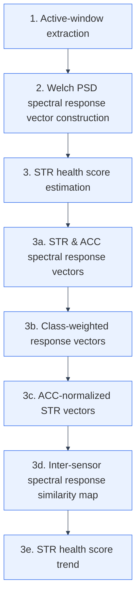

# EWSHM 2026 Students & Young Professionals Challenge

## Event-Level Bridge Health Scoring from Multimodal STR/ACC Responses

[](https://ewshm2026.com/ewshm-challenge)
[](https://ewshm2026.com/ewshm-challenge)
[](https://www.kaist.ac.kr/)
[](https://www.python.org/)

## About

Event-level signal-processing framework for health scoring of 4-span bridges using triggered strain and acceleration responses. The method builds spanwise inter-sensor response similarity maps to track ageing trends and identify anomalous events under varying traffic and operating conditions.

This repository contains the core preprocessing scripts, compact sample data, and three analysis notebooks developed for **Subject 1: Data-driven detection of trends and anomalies in civil engineering applications** in the **12th European Workshop on Structural Health Monitoring (EWSHM 2026) Students & Young Professionals Challenge**.

## Team Affiliation

**Korea Advanced Institute of Science and Technology (KAIST)**<br>
Department of Civil and Environmental Engineering

## Challenge Context

The EWSHM Challenge encourages young researchers to develop and present practical SHM methods to an international community from academia, industry, authorities, and research organizations.

- **Conference:** 12th EWSHM, July 7-10, 2026
- **Challenge:** EWSHM 2026 Students & Young Professionals Challenge
- **Selected subject:** Subject 1, data-driven trend and anomaly detection in civil engineering applications
- **Official challenge page:** <https://ewshm2026.com/ewshm-challenge>

## Core Idea

Triggered bridge responses are converted into frequency-class response vectors. STR response vectors are corrected using local ACC input information, and the corrected STR vectors are compared pairwise to build an inter-sensor spectral response similarity map.

The health score is derived from two complementary consistency measures:

1. **Same-group consistency:** response similarity among STR sensors with comparable structural roles.
2. **Opposite-span consistency:** response similarity across opposite spans, used as a structural redundancy check.

## Processing Pipeline



| Stage | Output |
|---:|---|
| 1 | Active-window STR/ACC event responses |
| 2 | Class-wise Welch PSD spectral response vectors |
| 3 | STR health score trajectories from ACC-normalized inter-sensor similarity |

## Repository Layout

```text
.
|-- sample_data/
|   |-- raw_json/       # One compact raw JSON sample per AQUINAS set
|   `-- event_hdf5/     # One compact event-level HDF5 sample per AQUINAS set
|
|-- preprocess_aquinas_hdf5.py
|   Raw contest data to set/deck-level HDF5 preprocessing.
|
|-- preprocess_aquinas_event_hdf5.py
|   Event-level HDF5 preprocessing and aligned sensor response export.
|
|-- notebooks/
|   |-- 1_Broad_band_spectral_partitioning.ipynb
|   |-- 2_Welch_PSD_Calculation.ipynb
|   `-- 3_ACC_Classwise_Input_Normalized_STR_Health_Scoring.ipynb
|
|-- utils/
|   Notebook helper functions used by the submitted workflow.
|
`-- KYM/src/aquinas/
    Lightweight dataset table loaders used by preprocessing.
```

## Notebook Sequence

| Step | Notebook | Purpose |
|---:|---|---|
| 1 | `1_Broad_band_spectral_partitioning.ipynb` | Defines broad PSD classes and visualizes STR/ACC event responses. |
| 2 | `2_Welch_PSD_Calculation.ipynb` | Converts active-window signals into class-wise spectral response vectors. |
| 3 | `3_ACC_Classwise_Input_Normalized_STR_Health_Scoring.ipynb` | Builds ACC-normalized STR similarity maps and sensor health trends. |

## Sample Data

The full AQUINAS contest dataset is not included because it is large. Instead, this repository includes compact samples for quick structure checks:

- `sample_data/raw_json/`: one raw JSON file from each AQUINAS set
- `sample_data/event_hdf5/`: one preprocessed event-level HDF5 file from each AQUINAS set

These samples are intended for format inspection and lightweight testing only. Full-scale analysis requires the official contest dataset.

## Sensor Index Convention

The analysis uses a method-level sensor index so that figures and tables are consistent across notebooks.

| Range | Quantity | Meaning |
|---:|---|---|
| `1-12` | STR | Strain sensors |
| `13-24` | ACC | Acceleration sensors |

The STR order is:

```text
1  S1 DO INF STR     7  S1 UP INF STR
2  S1 DO SHE STR     8  S1 UP SHE STR
3  S1 DO SUP STR     9  S1 UP SUP STR
4  S2 DO INF STR     10 S2 UP INF STR
5  S2 DO SHE STR     11 S2 UP SHE STR
6  S2 DO SUP STR     12 S2 UP SUP STR
```

## Spectral Response Classes

| Class | Frequency range | Interpretation |
|---|---:|---|
| Quasi-static | 0.05-0.80 Hz | Vehicle-induced slow deflection response |
| Low dynamic | 0.80-2.00 Hz | Slow bending with low-frequency vibration |
| Mid dynamic | 2.00-5.00 Hz | Dominant vehicle-induced bridge vibration |
| High dynamic | 5.00-12.00 Hz | Higher-frequency vibration with axle/road effects |
| Noise-sensitive | 12.00-25.00 Hz | Impact, road-surface vibration, and sensor-noise-sensitive range |

## Quick Start

Create an environment and install the required packages:

```bash
python -m venv .venv
source .venv/bin/activate
pip install -r requirements.txt
```

For full-scale preprocessing, point the code to the official contest dataset:

```bash
export AQUINAS_DATASET_PATH=/path/to/EWSHM-contest-data
python preprocess_aquinas_hdf5.py
python preprocess_aquinas_event_hdf5.py
```

Then open the notebooks in order:

```bash
jupyter lab notebooks/
```

## Resources

- EWSHM 2026 Challenge: <https://ewshm2026.com/ewshm-challenge>
- EWSHM 2026 Conference: <https://ewshm2026.com/>
- KAIST: <https://www.kaist.ac.kr/>

## Data Policy

Raw contest data, full generated HDF5 files, figures, and intermediate analysis tables are intentionally excluded from this repository. Only small representative samples are included under `sample_data/`.

Ignored local artifacts include:

- `EWSHM-contest-data/`
- `EWSHM_dataset_preprocessed/`
- `EWSHM_dataset_preprocessed_event_level/`
- `AutoResearch_generated_method/`
- `KYM/outputs/`

## Notes

This repository is organized for the EWSHM 2026 Students & Young Professionals Challenge submission. It is not a general-purpose bridge SHM package, and the frequency classes and sensor grouping rules are tailored to the provided contest dataset and sensor layout.
